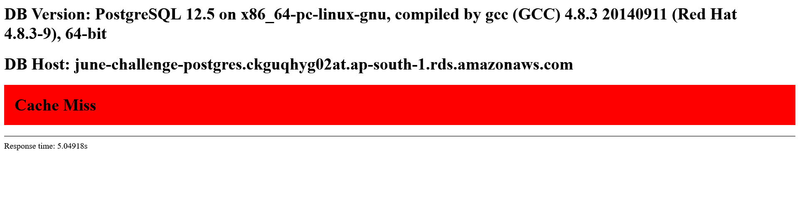
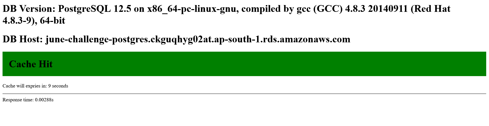

**Challenge Topic -** Improve application performance using Amazon ElastiCache

**Challenge Creator -** [David Thomas](https://www.linkedin.com/in/david-thomas-70ba433/)

**Challenge Goal -** Implement a Redis cluster using Amazon ElastiCache to cache database queries in a simple Python application.

### Project Structure

```
elastic-cache-challenge
│
└─── application
│   │   app.py
│   │   install.sql
│   │	requirements.txt
│   │
│   └─── config
│   │   database.ini
│   │   nginx-app.conf
│   │
│   └─── templates
│   	 index.html
│
└─── infrastructure
    │   cache.tf
    │   database.tf
    │   networking.tf
    │   output.tf
    │   provider.tf
    │   servers.tf
    │   variables.tf
```

### Screenshots



